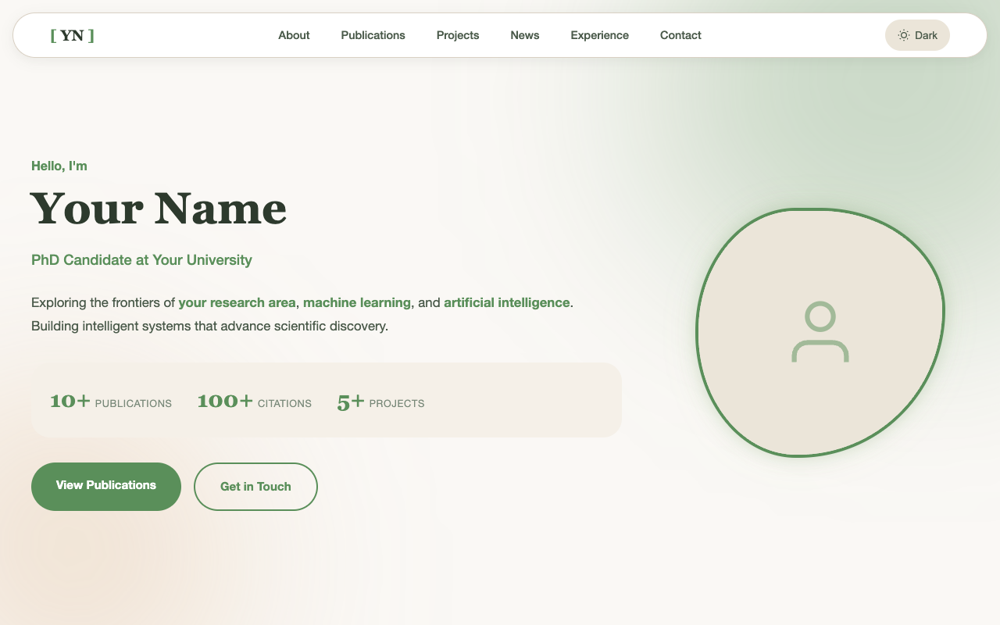
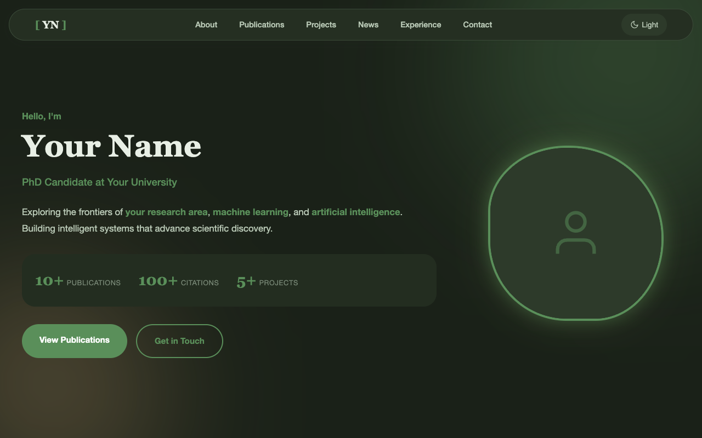
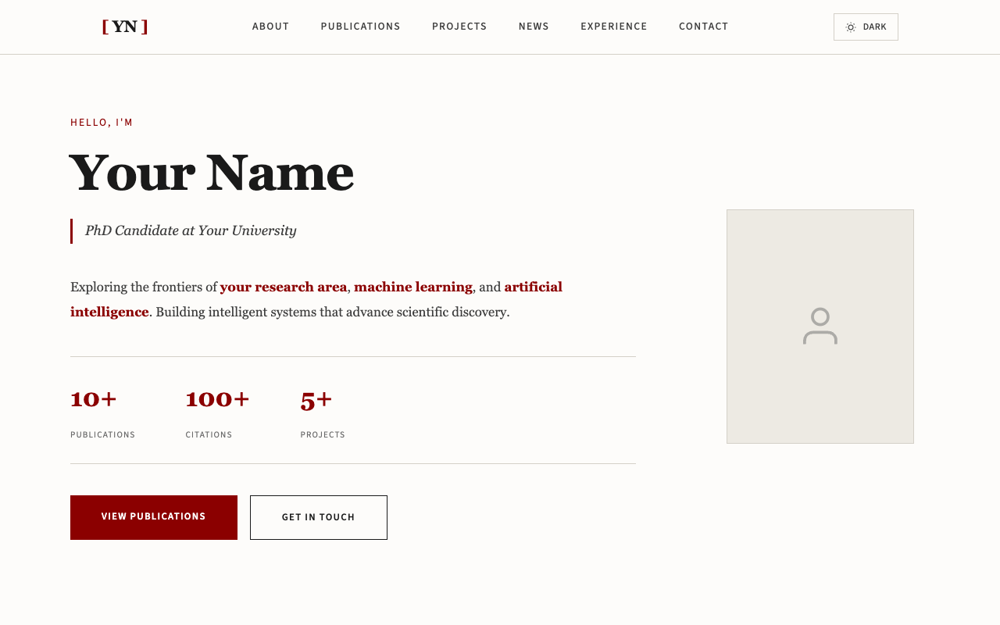
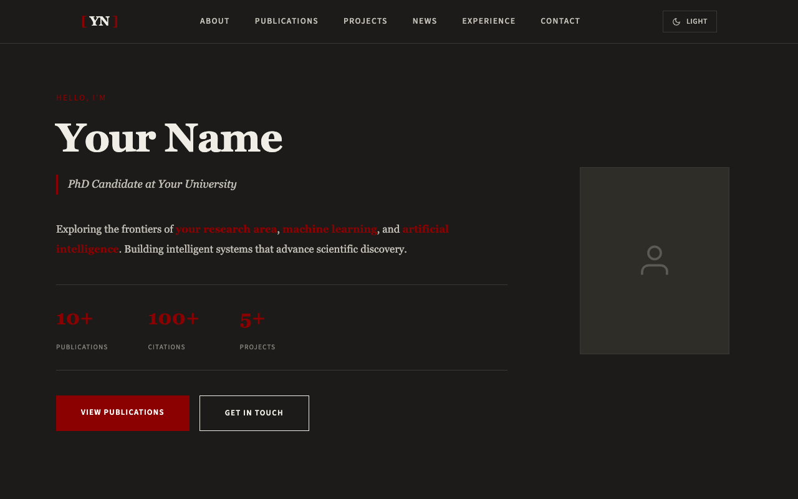
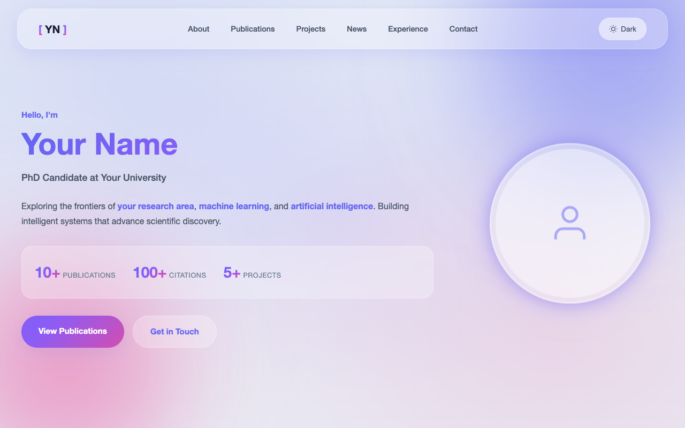
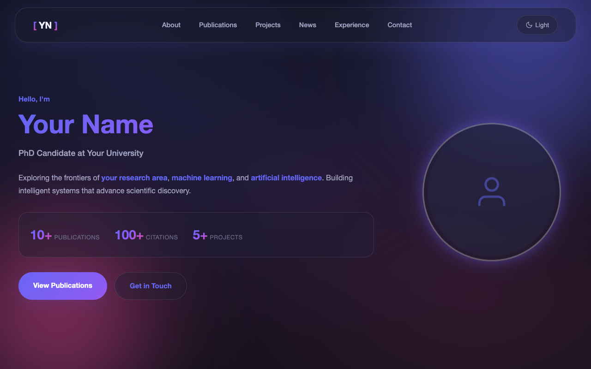
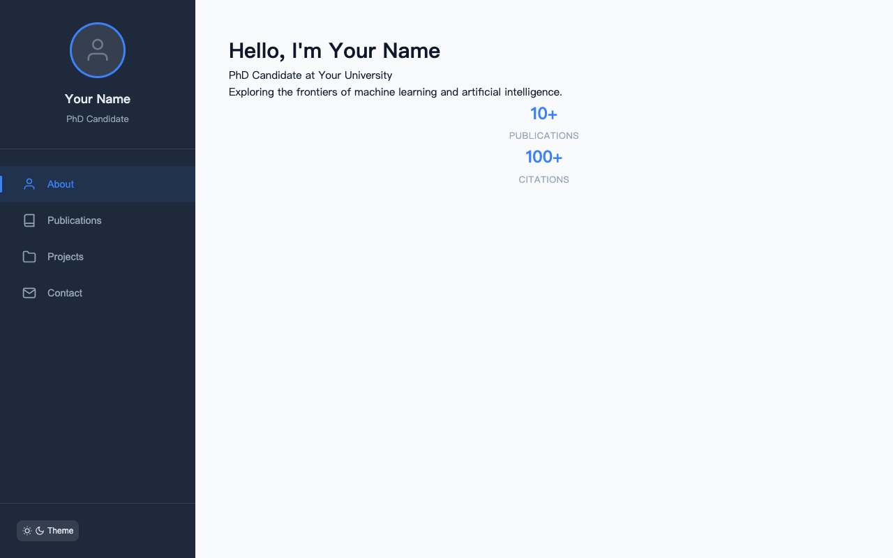
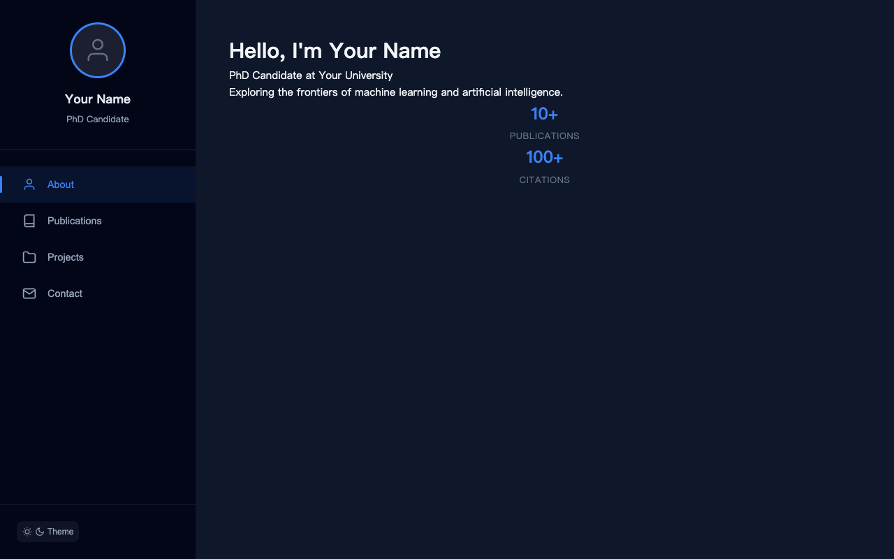

# Academic Homepage Templates

<p align="center">
  
  
  
  
</p>

<p align="center">
  <b>English</b> | <a href="README_CN.md">中文</a>
</p>

A collection of beautiful, responsive academic homepage templates for researchers and PhD students.

## Features

| Feature | Description |
|:-------:|-------------|
| 🎨 | **5 Unique Themes** - Academic, Natural, Editorial, Glass, SPA |
| 🌓 | **Dark/Light Mode** - Toggle with smooth transitions |
| 📱 | **Responsive Design** - Works on all devices |
| ⚡ | **No Build Tools** - Pure HTML, CSS, JavaScript |
| 🎯 | **Easy to Customize** - CSS variables for quick styling |
| 📝 | **Clean Code** - Semantic HTML structure |

## Themes

| Theme | Style | Best For |
|:-----:|-------|----------|
| 📚 **Academic** | Clean, minimal | Content-focused researchers |
| 🌿 **Natural** | Organic, warm | Creative academics |
| 📰 **Editorial** | Magazine-style | Writers & journalists |
| 💎 **Glass** | Glassmorphism | Modern tech researchers |
| 🖥️ **SPA** | Sidebar navigation | Portfolio-style pages |

## Preview

### Academic
| Light | Dark |
|-------|------|
|  |  |

### Natural
| Light | Dark |
|-------|------|
|  |  |

### Editorial
| Light | Dark |
|-------|------|
|  |  |

### Glass
| Light | Dark |
|-------|------|
|  |  |

### SPA
| Light | Dark |
|-------|------|
|  |  |

## Quick Start

1. Choose a theme from the `themes/` directory
2. Copy the theme folder to your project
3. Edit `index.html` with your information
4. Deploy to GitHub Pages or any static hosting

## Project Structure

```
academic-homepage-templates/
├── README.md
├── LICENSE
└── themes/
    ├── academic/
    │   ├── index.html
    │   ├── style.css
    │   └── script.js
    ├── natural/
    ├── editorial/
    ├── glass/
    └── spa/
```

## Customization

### Personal Information

Edit `index.html` and replace the placeholder text:

- `Your Name` → Your actual name
- `Your University` → Your institution
- `your.email@university.edu` → Your email
- Update publications, projects, and experience sections

### Colors

Each theme uses CSS variables. Edit `style.css`:

```css
:root {
    --accent-color: #your-color;
    --bg-primary: #your-bg;
}
```

## Deployment

### GitHub Pages

1. Create a new repository
2. Upload your chosen theme files
3. Go to Settings → Pages
4. Select "main" branch and save

### Other Hosting

Simply upload the HTML, CSS, and JS files to any static hosting service.

## License

MIT License - feel free to use for personal or commercial projects.

## Credits

Created with care for the academic community.
